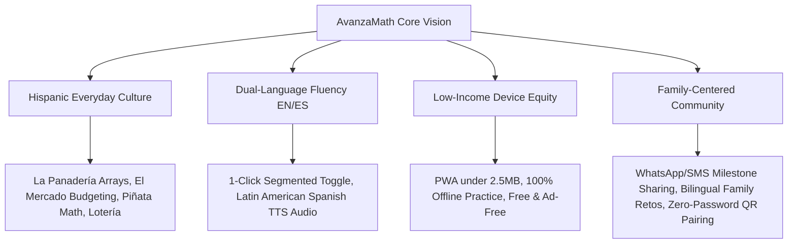
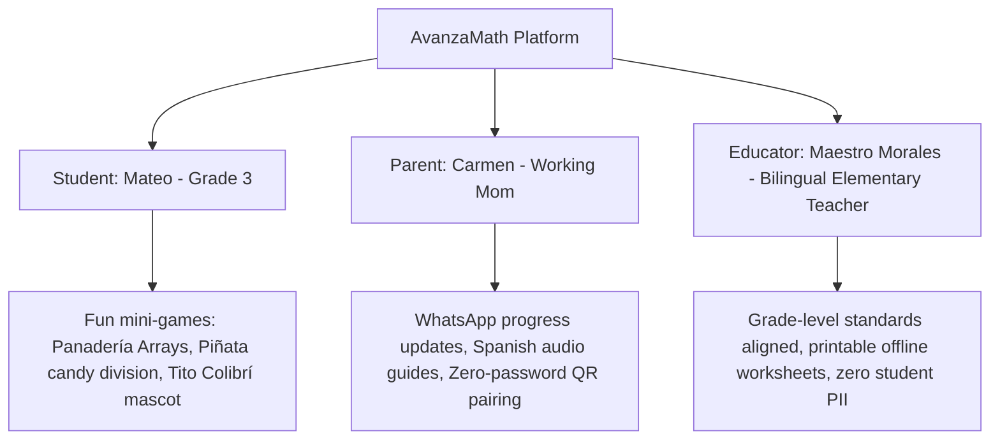
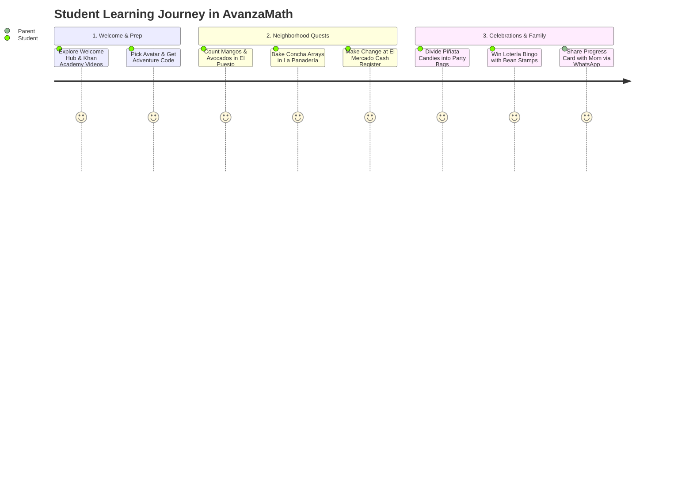
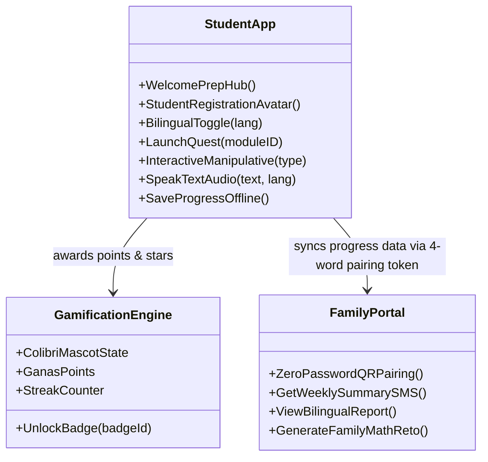
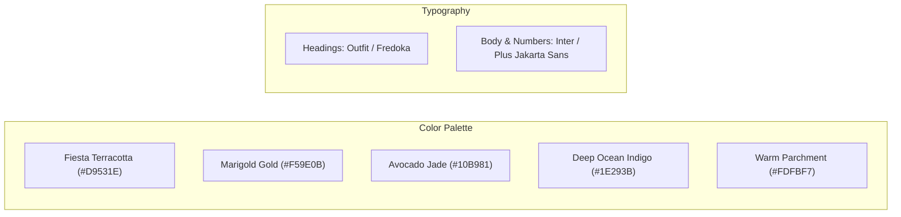
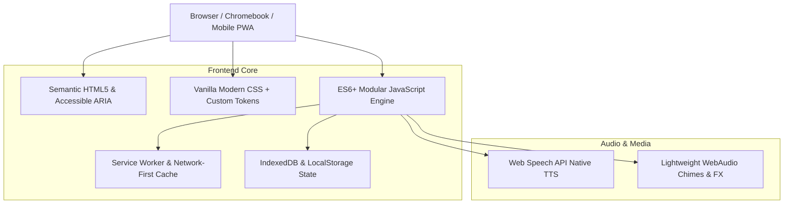
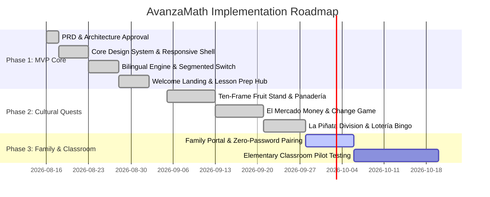

# Product Requirement Document (PRD)
## Project: AvanzaMath — Hispanic Cultural Elementary Math Platform

---

| **Document Version** | 1.3.0 | **Target Audience** | Elementary Students (Grades K–5), Families, Elementary Educators |
| **Status** | Approved for Architecture & Development | **Primary Focus** | Low-Income Hispanic Neighborhoods & Bilingual Equity |
| **Author** | Product & Pedagogical Engineering Team | **Key Technology** | Offline-First PWA (Bilingual HTML5, Modern CSS, Web Speech API) |

---

## 1. Executive Summary & Vision

### 1.1 Vision Statement
**AvanzaMath** is an equity-centered, bilingual, gamified elementary mathematics learning platform designed specifically for students in grades K–5 from low-income, predominantly Hispanic neighborhoods.

Rather than presenting mathematics through abstract, disconnected exercises, AvanzaMath grounds foundational arithmetic (**Addition, Subtraction, Multiplication, Division**) in the vibrant, familiar world of Hispanic culture and everyday neighborhood life—from counting pan dulce at *La Panadería*, budgeting at *El Mercado*, and dividing treats from *La Piñata*, to playing *Lotería Matemática* and learning about modern Hispanic STEM icons like astronaut Dr. Ellen Ochoa and legendary calculus teacher Jaime Escalante.

### 1.2 Core Value Proposition
- **Familiar & Culturally Resonant Contexts**: Uses everyday themes Hispanic elementary kids immediately recognize (pan dulce, aguas frescas, tienditas, soccer, piñatas, and family recipes).
- **Dual-Language Fluency (English & Spanish)**: Universal segmented language switch (`[ 🇲🇽 ES | 🇺🇸 EN ]`) with native Web Speech audio pronunciation to empower English Language Learners (ELL) and Spanish-speaking households.
- **Radical Accessibility for Low-Income Households**: Ultra-lightweight (< 2.5 MB), offline-first Progressive Web App (PWA) with a Network-First caching strategy that runs smoothly on budget smartphones, shared family devices, and school-issued Chromebooks.
- **Zero-Friction Student Onboarding**: Kid-friendly, COPPA-compliant avatar creation with 4-word magic recovery codes—no emails, passwords, or personal data required.
- **Family-Centric Empowerment**: Simple Spanish/English dashboards, zero-password QR pairing, and WhatsApp shareable progress cards so busy parents can celebrate their child's math growth without language barriers.

---

## 2. Problem Statement & Demographic Context

### 2.1 The Core Challenges in Low-Income Hispanic Communities
1. **Curriculum Disconnection**: Standard elementary math word problems often rely on culturally unfamiliar contexts (e.g., hockey tickets, suburban lawn mowing) rather than scenarios that Hispanic kids live and breathe every day.
2. **Language Friction for Dual-Language Learners**: ELL students frequently understand mathematical logic but struggle with English-heavy standardized phrasing, creating early math anxiety.
3. **Digital & Hardware Constraints**: Many low-income families rely on prepaid cellular data, share a single smartphone between multiple siblings, or use older Chromebooks with limited storage and intermittent internet.
4. **Parental Language Barriers & Authentication Friction**: Spanish-speaking parents deeply care about their children's education but often encounter complex, English-only school apps requiring passwords, email verification, or paid subscriptions.

---

## 3. Target User Personas

### 3.1 Primary Persona: The Student
- **Name**: Mateo (Age 8, 3rd Grade)
- **Profile**: Lives in a bilingual home in a predominantly Hispanic neighborhood. Loves soccer (*fútbol*), video games, and trips to the local bakery with his grandfather.
- **Pain Point**: Struggles with multiplication facts and feels nervous when timed tests happen in class.
- **Need**: Visual, game-like practice that feels familiar and rewarding, with positive, non-punitive feedback and a fun avatar companion.

### 3.2 Secondary Persona: The Caregiver
- **Name**: Carmen (Mateo’s Mother)
- **Profile**: Works long shifts; primary language is Spanish. Shares one smartphone with Mateo and his sister.
- **Pain Point**: Wants to help Mateo with math homework but finds modern school math terminology confusing and English-only.
- **Need**: Clear Spanish progress notifications via WhatsApp, offline practice, and simple dinner-table math ideas (*Retos en Familia*).

### 3.3 Tertiary Persona: The Bilingual Educator
- **Name**: Maestro Morales (3rd Grade Dual-Immersion Elementary Teacher)
- **Profile**: Teaches 28 students at a public elementary school; 80% of his students are Hispanic dual-language learners.
- **Pain Point**: Needs supplementary math stations that reinforce grade-level state standards while celebrating Hispanic culture.
- **Need**: Fast diagnostic quizzes, printable bilingual worksheets, and zero student account creation friction.

---

## 4. Curriculum & Pedagogical Framework

AvanzaMath uses the **Concrete-Pictorial-Abstract (CPA)** learning model combined with **Culturally Responsive Teaching (CRT)**.

### 4.1 Scope & Sequence by Grade Level

| Level | Grade | Arithmetic Domain | Core Competencies | Hispanic Cultural Theme Module |
| :--- | :--- | :--- | :--- | :--- |
| **Nivel 1** | K – 1st | Number Sense & Intro to Addition/Subtraction | Counting 0–20, Ten-Frames, Number Bonds, Single-digit (+ / -) | **El Puesto de Frutas:** Counting mangos, aguacates, and papayas on 10-frames; **La Dulcería:** Counting dulces. |
| **Nivel 2** | 2nd – 3rd | Multi-digit Add/Sub & Intro to Multiplication | Regrouping (+/-), Arrays, Skip Counting, Times Tables (1–10) | **La Panadería:** Conchas & empanadas in baking trays (rows $\times$ cols); **El Mercado:** Dollars & coins ($1, $5, $10, $20, 25¢). |
| **Nivel 3** | 4th – 5th | Multi-digit Multi/Division & Fractions/Word Problems | Long Division, Factors, Multiples, Equivalent Fractions | **La Piñata:** Fair candy division; **La Cocina:** Scaling chocolate caliente & tamale recipes; **Héroes STEM:** Dr. Ellen Ochoa space trajectories. |
| **Todos** | K – 5th | Rapid Mental Math Review | All 4 Operations (+, −, ×, ÷), Speed, Pattern Recognition | **Lotería Matemática:** 4x4 Bingo tabla with bean markers, operation filters, and vocal card caller (*El Cantor*). |

---

## 5. Hispanic Cultural Integration Modules ("El Sistema Nuestra Cultura")

### 5.1 Everyday Neighborhood & Community Quests
1. **La Panadería de Don Carlos (Multiplication & Arrays)**:
   - Students learn multiplication as equal rows and columns by arranging *conchas*, *cuernitos*, and *mantecadas* on bakery trays (e.g., 3 rows of 4 conchas $= 12$ conchas).
2. **El Mercado y El Puesto de Frutas (Addition, Subtraction & Money)**:
   - Calculating totals and making change with dollars and coins ($1, $5, $10, $20 bills, 25¢ quarters, 10¢ dimes, 5¢ nickels, 1¢ pennies).
   - Real-world budgeting: Buying ingredients for family dinner within a $15 or $20 budget.
3. **El Puesto de Paletas y Aguas Frescas (Mental Math & Operations)**:
   - Rapid addition and subtraction of prices for *paletas de fresa*, *horchata*, and *limonada*.

### 5.2 Celebrations, Food & Family Traditions
1. **La Piñata de Cumpleaños (Division & Fair Sharing)**:
   - Visualizing division as fair sharing: "If the piñata had 48 candies and there are 6 children at the fiesta, how many treats does each child receive?"
2. **La Cocina de la Abuela (Fractions, Scaling & Ratios)**:
   - Scaling recipes: Doubling ingredients for *chocolate caliente* (multiplying fractions: $3/4 \text{ cup} \times 2 = 1\frac{1}{2} \text{ cups}$).
   - Batching tamales: Dividing 36 tamales equally into 3 steaming pots (*tamaleras*).
3. **Lotería Matemática (Fast Mental Math Bingo)**:
   - A lively math spin on the traditional game *La Lotería*. A caller reads mental math cards ("¡El número que es $48 \div 6$!") and students place beans on their 4x4 card to yell "¡Buenas!". Includes filters for individual operations (+, −, ×, ÷) or mixed.

### 5.3 Hispanic STEM Role Models & Pioneers
- **Dr. Ellen Ochoa (First Hispanic Woman in Space)**: Mission trajectory arithmetic, countdown subtraction, and satellite distance multiplication.
- **Jaime Escalante ("Ganas" Calculus Pioneer)**: Problem-solving challenges emphasizing perseverance and belief that anyone can master math.
- **Diana Trujillo (NASA Mars Flight Director)**: Robotic rover wheel rotation and distance division calculations.

---

## 6. Functional Requirements & Feature Specifications

### 6.1 Detailed Functional Requirements

#### FR-01: Welcome Landing & Quick Lesson Prep Hub (Página de Bienvenida)
- **Description**: Dedicated initial landing view introducing the platform with warm cultural greeting and topic preparation.
- **Features**:
  - Hero welcoming banner featuring *Tito el Colibrí* and direct CTAs to start math quests or play Lotería.
  - **Quick Prep Lesson Cards**: Explains the foundational concept and visual trick for each quest (Ten-frames grouping, Multiplication arrays, Money subtraction formula, and Division fair sharing).
  - **Curated Educational Video Linkages**: Direct external links to high-quality Khan Academy (English and Spanish) and Math Antics video lessons aligned to each module.
  - **1-Click Quest Launch**: Direct buttons to immediately test the concept in practice.

#### FR-02: Student Onboarding, Identity & Avatar Profile System (Registro sin Fricción)
- **Description**: Kid-friendly, COPPA-compliant onboarding requiring zero emails, passwords, or personal identifying information (PII).
- **Features**:
  - **Avatar Companion Selection**: Students adopt a cultural mascot companion (*Tito el Colibrí 🐦*, *Sol el Axolote 🦎*, *Luna la Mariposa 🦋*, *Pepe el Jaguar 🐆*).
  - **Child-Friendly Nickname**: Students enter a first name or generate a fun math superhero alias (e.g., *"Mateo Campeón"*, *"Sofia Estrella"*).
  - **4-Word Magic Recovery Code & QR "Pasaporte"**: The system generates an anonymous 4-word phrase (e.g., `Colibri-Pan-Sol-24`) and a printable QR code passport, allowing students to seamlessly resume progress across school Chromebooks and home tablets without login credentials.

#### FR-03: Interactive Digital Manipulatives (Manipulativos Digitales)
- **Description**: Visual, hands-on tools designed for touchscreens and Chromebook trackpads.
- **Components**:
  - **Ten-Frames with Dynamic Fruit Emojis**: Real matching fruit icons (🥭 mangos, 🥑 aguacates, 🍊 naranjas, 🍈 papayas) for K–1 counting and single-digit operations.
  - **Panadería Bakery Trays**: Dynamic grid arrays of *conchas* (pink, chocolate, vanilla) to visualize rows $\times$ columns multiplication.
  - **Mercado Cash Register & Coin Counter**: Draggable bills ($1, $5, $10, $20) and coins to calculate purchases and change.
  - **Piñata Candy Sorter**: Equal candy distribution into celebratory party favor bags (*bolsitas*).

#### FR-04: Friendly Hispanic Mascot & "Ganas" Gamification
- **Mechanics**:
  - *Tito el Colibrí* acts as a supportive tutor, offering growth-mindset tips and cultural encouragement on every screen.
  - Completing daily practice awards **"Puntos Ganas"** (Grit Points) and colorful stars.
  - **Non-Punitive Pedagogy**: Incorrect answers trigger encouraging scaffolding hints ("*¡Casi! Vamos a contar las filas juntos*") with zero loss of lives or lockouts.

#### FR-05: Instant Dual-Language Engine & Audio Synthesis
- **Description**: Segmented header switch (`[ 🇲🇽 ES | 🇺🇸 EN ]`) providing instant page-wide language toggling.
- **Audio Features**:
  - Native Web Speech API text-to-speech provides Latin American Spanish (`es-MX`, `es-US`, `es-419`) and English (`en-US`) read-aloud.
  - **Pronunciation Normalizer**: Translates symbols naturally (Spanish: `+` *"más"*, `−` *"menos"*, `×` *"por"*, `÷` *"entre"*; English: `+` *"plus"*, `−` *"minus"*, `×` *"times"*, `÷` *"divided by"*).
  - Dedicated **Auto-Voice Toggle** (`🗣️ Auto: OFF` by default) with manual on-demand `🔊 Read Aloud` on every card.

#### FR-06: Offline-First Progressive Web App (PWA)
- **Requirements**:
  - 100% of core arithmetic practice, audio syntheses, and mini-games function without active internet connectivity via Service Worker caching.
  - **Network-First Caching Strategy**: Ensures fresh files are always fetched live during updates, falling back to cache only when offline.
  - Total initial download footprint strictly **< 2.5 MB** for fast loading on 3G connections.

#### FR-07: Family Math Center (El Portal Familiar) & Parent-Child Association
- **Description**: Dedicated caregiver dashboard designed for working-class, Spanish-speaking and bilingual parents.
- **Parent-Child Pairing Architecture**:
  1. **Shared Home Device Direct Access**: One tap on the *Portal Familiar* tab displays the child's live mastery bars and stats on the home phone/tablet.
  2. **Zero-Password QR & Magic Link Pairing**: Parents scan the child's "Pasaporte QR" or enter their 4-word code (`Colibri-Pan-Sol-24`) to link their phone to a read-only progress dashboard without account registration.
  3. **One-Tap WhatsApp / SMS Progress Card**: Encodes current mastery into a celebratory, pre-filled WhatsApp message with audio voiceover link.
  4. **"Reto en Familia" (Weekly Family Challenge)**: Practical dinner-table or supermarket math prompts in Spanish.
  5. **Printable Bilingual Offline Worksheets**: Ready-to-print practice sheets for home or classroom stations.

---

## 7. Non-Functional Requirements (NFR)

| ID | Category | Requirement Description | Target Metric |
| :--- | :--- | :--- | :--- |
| **NFR-01** | **Performance** | First Contentful Paint (FCP) on budget mobile phones / Chromebooks. | $\le 1.2\text{ s}$ |
| **NFR-02** | **Bundle Size** | Total compressed asset payload (HTML, CSS, JS, SVGs, audio FX). | $\le 2.5\text{ MB}$ |
| **NFR-03** | **Accessibility** | Full WCAG 2.1 Level AA compliance, large touch targets ($\ge 48\text{px}$). | 100% Lighthouse Score |
| **NFR-04** | **Device Compatibility** | Seamless execution on budget Android devices, iPad iOS, ChromeOS. | > 99% Compatibility |
| **NFR-05** | **Privacy & Legal (COPPA/FERPA)**| Zero student PII collected. No emails, passwords, ad trackers, or behavioral profiling. | 100% Compliance |
| **NFR-06** | **Offline Capability** | All core practice problems and audio TTS must operate with zero active Wi-Fi. | 100% Offline Functional |

---

## 8. UX/UI Design & Aesthetic Guidelines

### 8.1 Visual Aesthetic Identity
- **Palette**: Inspired by vibrant Hispanic neighborhood culture (warm terracotta `#D9531E`, festive marigold `#F59E0B`, fresh jade `#10B981`, midnight blue `#1E293B`, and clean off-white `#FDFBF7`).
- **Typography**: Clean, rounded, highly readable fonts (*Outfit* for friendly headings; *Plus Jakarta Sans* / *Inter* for high-clarity numeral glyphs).
- **Tactile UI Elements**: Large, chunky buttons with high contrast touch targets ($\ge 48\text{px} \times 48\text{px}$) designed for small hands on tablets and smartphones.
- **Segmented Control UI**: Clear dual-state controls (`[ 🇲🇽 ES | 🇺🇸 EN ]`) ensuring unambiguous state visibility.

---

## 9. Technology Architecture & Implementation Stack

### 9.1 Recommended Technology Stack
- **Architecture**: Single Page Application (SPA) / Progressive Web App (PWA).
- **Core Frontend**: Semantic HTML5, Modern CSS Custom Properties, Modular Vanilla JavaScript.
- **Audio Engine**: Native `window.speechSynthesis` (with Latin American Spanish and US English voices) and procedural Web Audio synthesized sound effects.
- **Graphics**: Scalable Vector Graphics (SVG) with CSS animations for zero-weight rendering.
- **Storage**: Browser LocalStorage / IndexedDB for local mastery tracking and offline state persistence.

---

## 10. Project Roadmap & Release Milestones

---

## 11. Risk Assessment & Mitigation Matrix

| Risk Factor | Impact | Likelihood | Mitigation Strategy |
| :--- | :--- | :--- | :--- |
| **Low Household Bandwidth** | High | High | Network-first Service Worker caching and keeping initial bundle $\le 2.5\text{MB}$. |
| **Student Login Friction** | High | Medium | Zero-PII onboarding with avatar selection and 4-word anonymous magic codes. |
| **Speech API Accent Variations** | Medium | Medium | Test and prioritize standard Latin American Spanish (`es-419`, `es-MX`, `es-US`) with clear text fallback. |
| **Math Anxiety & Frustration** | High | Low | Non-punitive micro-rewards, cheerful mascot encouragement, and visual step-by-step hints. |
| **Parent Adoption Barriers** | Medium | Medium | Zero-password QR pairing, frictionless WhatsApp sharing, and practical dinner-table retos. |

---

## 12. Verification & Acceptance Criteria

1. **Accessibility**: All buttons, inputs, and questions have explicit `aria-label` attributes and achieve a 100 score on Lighthouse / axe-core audits.
2. **Instant Language Switching**: Segmented language switcher toggles between English and Español under $50\text{ms}$ with full persistence across page refreshes.
3. **100% Offline Capability**: Disconnecting Wi-Fi during a math quest allows full continuation of problem solving, animations, audio, and local streak tracking.
4. **COPPA / FERPA Compliance**: Zero collection of student emails, passwords, or personal identifying data.
5. **Cultural Grounding**: Every grade level includes distinct, everyday Hispanic cultural scenarios (*La Panadería*, *El Mercado*, *La Piñata*, *Lotería*, or *Héroes STEM*).

---
*Document approved for development by Product, Curriculum, and Engineering Leads.*
